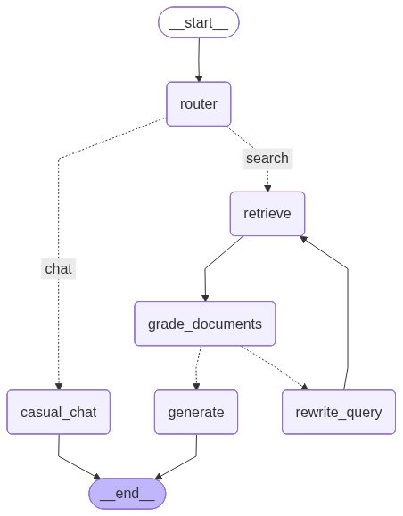

# Intelligent Agentic RAG for Medical Data

> **A self-governing, context-aware retrieval agent designed for high-precision extraction from complex medical product catalogs.**

---

## Why This Architecture?

This is not a standard "vector search wrapper." Medical product catalogs are dense, table-heavy, and require exact precision, hallucinating a syringe diameter is not an option.

This project implements an **Agentic RAG** system that prioritizes **accuracy, transparency, and self-correction**.

### Key Architectural Decisions



#### 1. **Hybrid Search (BM25 + Semantic Vector)**
*   **The Problem:** My first approach used **pure vector (semantic) search only**. It worked well for natural language queries like "needles for deep injections," but I quickly discovered it had a hard time reliably finding products by their exact ID (e.g., "Art.-Nr. 4550242"). Embedding models treat numbers abstractly, so exact catalog numbers were often missed or matched incorrectly.
*   **The Solution:** To fix this, I added **BM25 keyword search** alongside the existing vector search, creating a **Hybrid Retriever**. It runs both BM25 (keyword) and Vector (semantic) searches in parallel, deduplicates results, and re-ranks them. BM25 excels at exact token matching (perfect for product IDs), while vector search handles semantic meaning.
*   **The Result:** Users can now search by exact catalog number *or* vague natural language descriptions with equal success, something neither approach could achieve alone.

#### 2. **"Table-First" Ingestion Strategy**
*   **The Problem:** RAG pipelines often blindly chunk text, breaking tables mid-row or losing the column headers. In a medical catalog, a number like "0.45" is meaningless without its column header ("Diameter (mm)").
*   **The Solution:**
    *   I used `PyMuPDF` to detect and extract tables **independently**.
    *   Each table is converted to a clean Markdown format to preserve structure for the LLM.
    *   **Heuristic Context Injection:** The ingestion script intelligently scans the page text to find the **Product Name** (e.g., "Omnifix®") and prepends it to the table chunk. This ensures isolated tables always carry their context.

#### 3. **Self-Correcting Agentic Loop (LangGraph)**
*   **The Problem:** A simple RAG pipeline retrieves "something" and tries to answer, even if the retrieval was garbage.
*   **The Solution:** I used **LangGraph** to build a state machine with a **Retrieval Grader**.
    *   **Step 1:** Retrieve documents.
    *   **Step 2:** An LLM "Grader" evaluates if the documents are actually relevant to the query.
    *   **Step 3 (The Agentic Part):** If documents are irrelevant, the agent **does not give up**. It enters a **Query Rewrite** loop, reformulating the user's question to be more specific (e.g., adding "medical catalog" context) and tries retrieving again.
    *   **Step 4:** Only if valid documents are found does it generate an answer. If not, it honestly admits "I don't know," preventing hallucinations.

#### 4. **Smart Routing**
*   **The Problem:** Using an expensive RAG chain for "Hi" or "What is the weather?" is wasteful and confusing.
*   **The Solution:** A specialized **Router** classifies intent immediately. Casual conversation bypasses the heavy RAG machinery entirely, ensuring instant, cost-effective responses for non-query interactions.

### Transparent, Real-Time Frontend

This project surfaces the agent's reasoning live so users can see *what* is happening and *why* they should trust the answer.

*   **Live Agent Steps (SSE):** The backend streams status events as the agent moves through each node. The frontend shows animated spinners for the active step and checkmarks for completed ones, no blank-screen waiting.
*   **Source Cards & Full-Text Modal:** Every answer includes clickable cards showing page number, content type (`text`/`table`), and match method (`Exact Match` via BM25 or `Semantic`). Clicking a card opens a modal with the raw source chunk so users can verify claims directly.
*   **Inline Source Citations:** The LLM's response embeds citation badges (e.g., `[p.12]`) that link back to the corresponding source card for instant traceability.
*   **Query Rewrite Transparency:** When the Grader triggers a rewrite, the reformulated query appears in a "Interpreted as" banner so users see exactly how their question was refined.

---

## Tech Stack

*   **Orchestration:** [LangGraph](https://langchain-ai.github.io/langgraph/) (Stateful agent workflows)
*   **Framework:** [LangChain](https://www.langchain.com/)
*   **Vector Querying:** [ChromaDB](https://www.trychroma.com/) (Local vector store) -> *Chosen for simplicity and speed in a prototype environment.*
*   **Retrieval:** `Rank_BM25` + `OpenAI Embeddings` via OpenRouter.
*   **PDF Processing:** `PyMuPDF` -> *Chosen for superior table extraction capabilities compared to pypdf.*
*   **Backend:** FastAPI -> *High-performance, async Python API.*
*   **Frontend:** Next.js (React) -> *Modern, responsive chat interface.*

---

## Trade-Offs & Future Improvements

This is a prototype, I focused on the core retrieval loop first. Here's what I consciously scoped out and what I'd tackle next:

| Decision | Why | Next Step |
|---|---|---|
| **No chat history** | Prioritized single-turn retrieval precision first; adding memory before the search pipeline was solid would have added complexity without value. | Add conversational memory via LangGraph checkpointers or an external store. |
| **Local ChromaDB** | Zero-infrastructure setup, anyone can clone and run in minutes, no cloud accounts needed. Swapping the store is a one-file change (`ingestion.py`). | Move to a hosted vector DB (Pinecone, Weaviate, etc.) for scalability. |
| **No disambiguation** | If a user asks "show me needles," the system retrieves a mix instead of asking for clarification. | Add a **Clarification Node** that detects diverse results and asks follow-up questions. |
| **Blind query rewriting** | When retrieval grading fails, the rewriter guesses a new query without knowing *why* it failed. | Pass **Grader Feedback** to the Rewriter so it can exclude irrelevant terms explicitly. |
| **No structured filtering** | Semantic search struggles with hard constraints like "shorter than 20mm." | Route specification queries to a **Structured Tool** that generates filters (e.g., `WHERE length < 20`). |

---

## Getting Started

### Prerequisites
*   Python 3.11+
*   Node.js 18+
*   An API Key for OpenRouter (or OpenAI)

### 1. Backend Setup

Move to the backend directory:
```bash
cd backend
```

Create a virtual environment:
```bash
python -m venv .venv
source .venv/bin/activate  # On Windows: .venv\Scripts\activate
```

Install dependencies:
```bash
pip install -e ".[dev]"
```

Configure Environment:
Create a `.env` file in `backend/` with the following content:
```ini
# backend/.env
OPENROUTER_API_KEY=sk-or-your-key-here
OPENROUTER_BASE_URL=https://openrouter.ai/api/v1
LLM_MODEL=google/gemini-2.0-flash-001
EMBEDDING_MODEL=openai/text-embedding-3-small
LOG_LEVEL=INFO
```

**Index the Data:**
The system is designed to **automatically index** the PDF on the first run if the vector database (`data/chroma`) is missing.
*Ensure `data/product_catalog_01.pdf` exists in the project root.*

Run the API:
```bash
# From the backend directory
uvicorn app.main:app --reload
```
*Watch the logs: "auto_indexing_started" will verify the process has begun.*

### Backend Quality Tooling

The backend uses `pyproject.toml` as the single source of truth for dependencies and tooling.

Run the quality checks from `backend/`:
```bash
ruff check app tests
ruff format --check app tests
mypy app
pytest
```

Enable pre-commit hooks from the repository root:
```bash
pre-commit install
pre-commit run --all-files
```

### 2. Frontend Setup

Open a new terminal and move to the frontend directory:
```bash
cd frontend
```

Install dependencies:
```bash
npm install
```

Run the development server:
```bash
npm run dev
```

Open [http://localhost:3000](http://localhost:3000) to start chatting.
